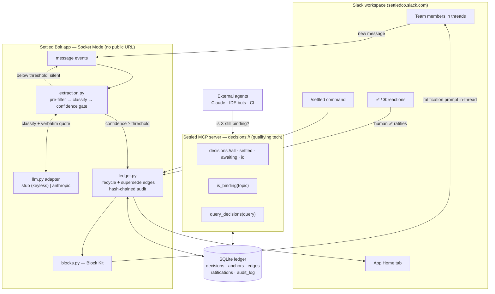

# Settled — architecture



## Key design decisions
1. **Verbatim anchor is the source of truth.** Each decision stores the exact substring of
   the source message + permalink. Summaries are display-only. (CogCanvas: verbatim beats
   summarization 93% vs 19% on constraint recall.)
2. **Epistemic status is typed, transitions are signal-driven.** Extraction only ever
   produces `proposed`. `settled` requires a human ✅. A newer settled decision on the same
   topic supersedes the old one via a signed `supersedes` edge. (OIDA: epistemic class +
   signed contradiction edges.)
3. **Precision-first gate.** Two stages — cheap regex pre-filter, then an LLM classifier
   with a confidence threshold (default 0.72). Below threshold the agent stays silent. A
   wrong "settled" is worse than no answer.
4. **Ungated qualifying tech.** The MCP server is self-built over the same SQLite ledger.
   No dependency on gated Slack AI features or the Real-Time Search API.
5. **Audit-ready.** `audit_log` is append-only and hash-chained
   (`SHA-256(prev_hash + content + ts)`), toward EU AI Act / DORA traceability.

## Data model
- **decisions** — topic, statement, status, owner, channel, confidence, timestamps
- **anchors** — verbatim quote, permalink, message_ts (the binding evidence)
- **edges** — `supersedes` / `contests` / `relates` between decisions
- **ratifications** — human ✅/❌ votes
- **audit_log** — hash-chained append-only trail

## Transport
Socket Mode (WebSocket) — the app needs no public URL or tunnel, which keeps the demo and
judge sandbox setup friction-free.
```
